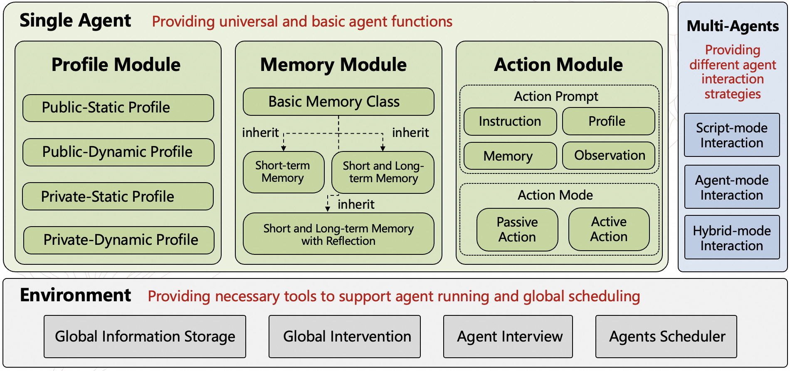
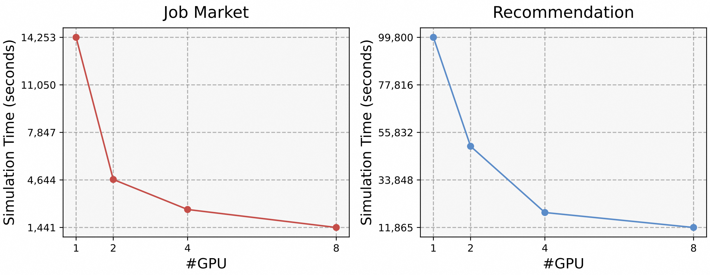

<div align=center>
    <h1>GenSim: A General Social Simulation Platform with Large Language Model based Agents</h1>
    
    
</div>

With the rapid advancement of large language models (LLMs), recent years have witnessed many promising studies on leveraging LLM-based agents to simulate human social behavior. While prior work has demonstrated significant potential across various domains, much of it has focused on specific scenarios involving a limited number of agents and has lacked the ability to adapt when errors occur during simulation. To overcome these limitations, we propose a novel LLM-agent-based simulation platform called GenSim, which: (1) Abstracts a set of general functions to simplify the simulation of customized social scenarios; (2) Supports one hundred thousand agents to better simulate large-scale populations in real-world contexts; (3) Incorporates error-correction mechanisms to ensure more reliable and long-term simulations. To evaluate our platform, we assess both the efficiency of large-scale agent simulations and the effectiveness of the error-correction mechanisms. To our knowledge, GenSim represents an initial step toward a general, large-scale, and correctable social simulation platform based on LLM agents, promising to further advance the field of social science.

<p align="center">
  
  <br>
  <b>Figure 1</b>: GenSim Framework
</p>

## 1. Install Dependencies
#### 1.1 Agentscope:

Install from source code (https://github.com/pan-x-c/AgentScope/tree/feature/pxc/async_create_agent). 
- Add two lines of code in the ``__init__`` function of `OpenAIWrapperBase` in the file `src/agentscope/models/openai_model.py`:
    ```python
    self.api_key = api_key
    self.client_args = client_args or {}
    ```

#### 1.2 Install the required dependencies:
```
pip install -r requirements.txt
```

### 2. Launch Embedding Model
#### 2.1 Run 
```
bash embedding_service/launch_multi_emb_models.sh
```
to launch the embedding model services.

#### 2.2 Config
Get the `embedding_api` (for example, [http://localhost:8001/](http://localhost:8003/)), and fill that URL into `simulation/examples/<scenario>/configs/simulation_config.yml`.

## 3. Launch LLM Model
#### 3.1 Run 
```bash
bash llm_service/launch_all_llm.sh
```
to launch the LLM model server.

#### 3.2 Config
Get the `llm_api` (for example, [http://localhost:8083/](http://localhost:8083/v1)), and fill that URL into `simulation/examples/<scenario>/configs/model_configs.json`. You can set multiply LLM models.

## 3. Config
Configure the following files in the configs directory of the specific scenario (e.g., `simulation/examples/<scenario>/configs`):

    - simulation_config.yml
    - memory_config.json
    - model_configs.json
    - xAgent_configs.json
    - yAgent_configs.json
    - ...

p.s. 
The `x` and `y` in the file names are placeholders for the specific agent class.


## 4. Simulate
### 4.1 Launch Distributed Agent Server
Run the following command to launch the distributed server:
```bash
bash simulation/launch_server.sh <server_num_per_host> <base_port> <scenario>
```

### 4.2 Run Simulation
Run the following command to run the simulation:
```python
python simulation/examples/<scenario>/simulator.py
```

### 4.3 Kill Distributed Server
After the simulation is completed, you can kill the distributed server.

Run the following command to kill the distributed server:
```bash
bash simulation/kill_all_server.sh
```

## Experiments
### 1. The benefits of Large Language Model-based Agents

<p align="center">
  
  <br>
  <b>Figure 2</b>: The standard deviation of the simulation results with different agent scales
</p>

### 2. Time Cost vs. Agent Quality 

<p align="center">
  
  <br>
  <b>Figure 3</b>: The time costs of different numbers of agents
</p>

### 3. The effects of our error-correction mechanism

<p align="center">
  
  <br>
  <b>Figure 4</b>: The effects of our error-correction mechanism in single (a) and multi (b) rounds, respectively
</p>

### 4. Time Cost vs. GPU Number

<p align="center">
  
  <br>
  <b>Figure 5</b>: The time costs of different numbers of LLM
</p>

### 5. Platform Display

<p align="center">
  
  <br>
  <b>Figure 6</b>: The platform display
</p>
